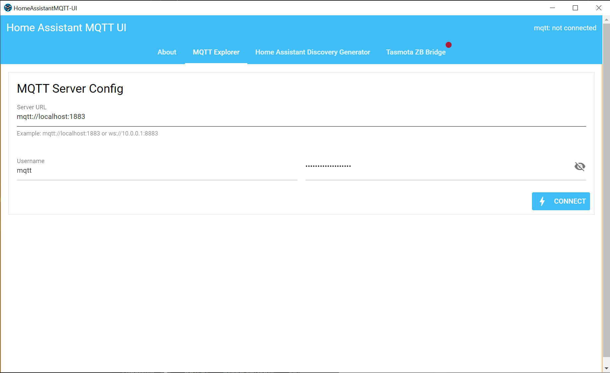
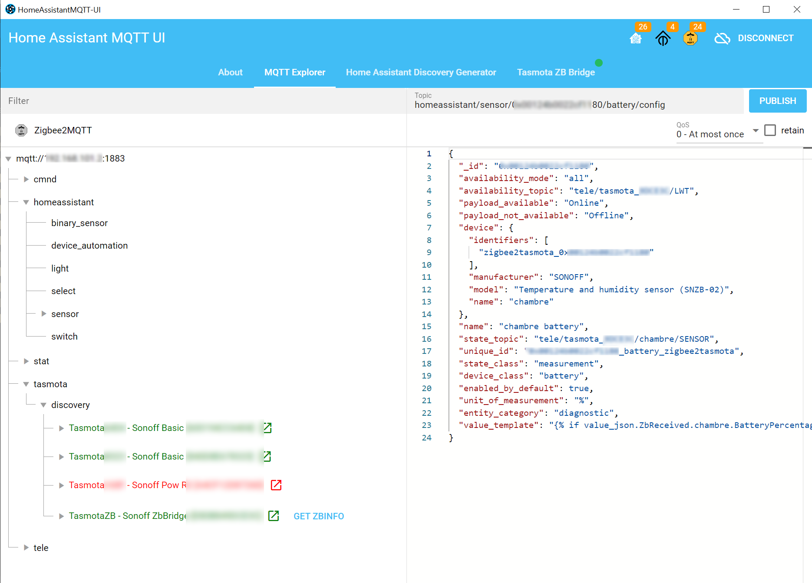
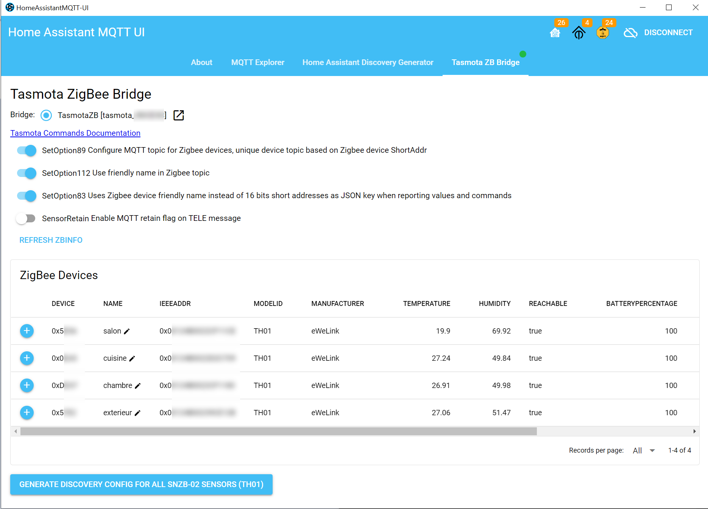
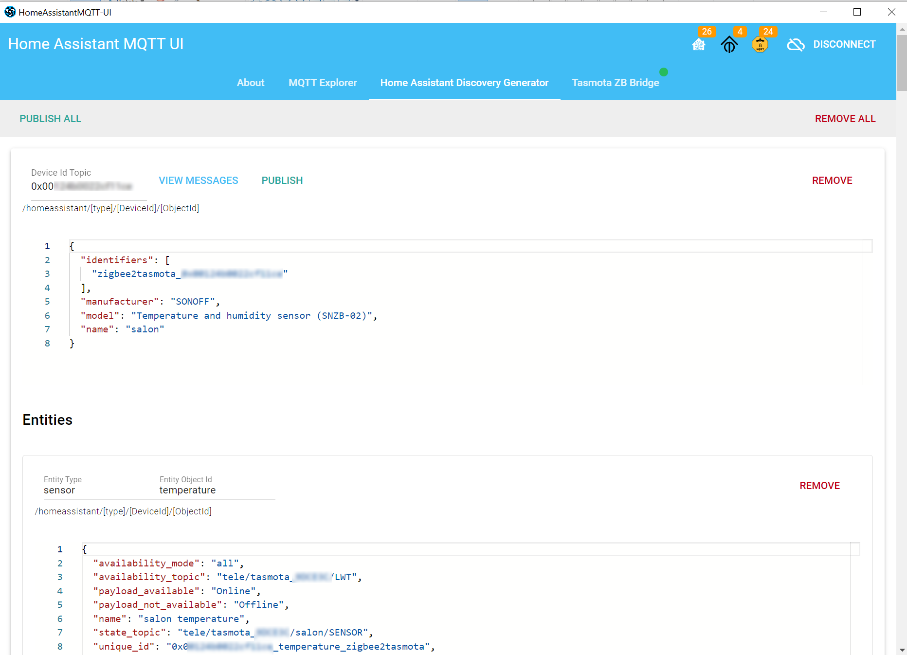

# Home Assistant MQTT UI (homeassistant-mqtt-ui)

UI to administer MQTT device discovery for Home Assistant

<div class="text-body1">
  Home Assistant MQTT UI is a small app to help configure custom MQTT
  devices for Home Assistant. Instead of creating a template you can use
  this app to publish a retained message to Home Assistant's MQTT Discovery
  topic. This allows to define sensors and other entities to a device, which
  is not supported via template.

The app has three main features:

  <ul>
    <li class="q-my-md">
      <b>MQTT Explorer*</b> - allows to explore MQTT topics specific to home
      assistant. Currently it knows about Home Assistant Discovery, Tasmota
      and Zigbee2MQTT. It can be used to explore and edit existing entries.
    </li>
    <li class="q-my-md">
      <b>Home Assistant Discovery Generator</b> - Helps in the creation of
      the Discovery message payload. Currently it has validation for
      <em>Sensor entities</em>.
    </li>
    <li class="q-my-md">
      <b>Tasmota ZB Bridge*</b> - Special feature to automatically detect
      Sonoff Zigbee Bridge (ZB Bridge) flashed with Tasmota. It can then
      help configure the device and automatically create the discovery
      message for Sonoff's SNZB-02 sensors (TH01).
      <ol>
        <li>Detect and configure Bridge</li>
        <li>Generate Discovery Config</li>
        <li>Publish All</li>
      </ol>
    </li>
  </ul>
  <small>* requires Desktop Version to connect to MQTT </small>
</div>

### Desktop

Download from the [release page](https://github.com/bfritscher/homeassistant-mqtt-ui/releases) or build your own.

#### _Linux_

App cannot be started by clicking on it, on Nautilus[\*](https://stackoverflow.com/questions/55060402/electron-executable-not-recognized-by-nautilus)

Make it executable and then you can run it from command line.

```
./'HomeAssistantMQTT-UI'
```

## Screenshots









# Development

## Install the dependencies

```bash
yarn
# or
npm install
```

### Start the app in development mode (hot-code reloading, error reporting, etc.)

```bash
quasar dev
quasar dev -m electron
```

### Lint the files

```bash
yarn lint
# or
npm run lint
```

### Format the files

```bash
yarn format
# or
npm run format
```

### Build the app for production

```bash
quasar build
quasar build -m electron
```

### Customize the configuration

See [Configuring quasar.config.js](https://v2.quasar.dev/quasar-cli-vite/quasar-config-js).
